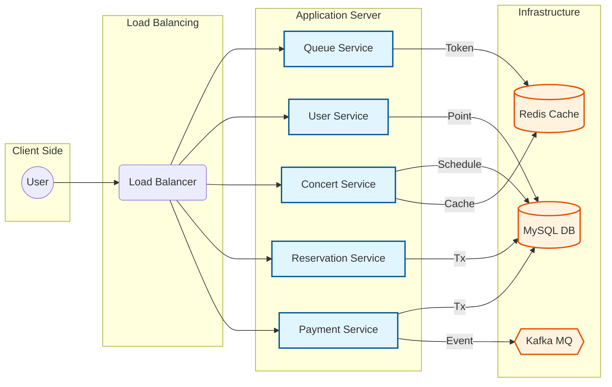
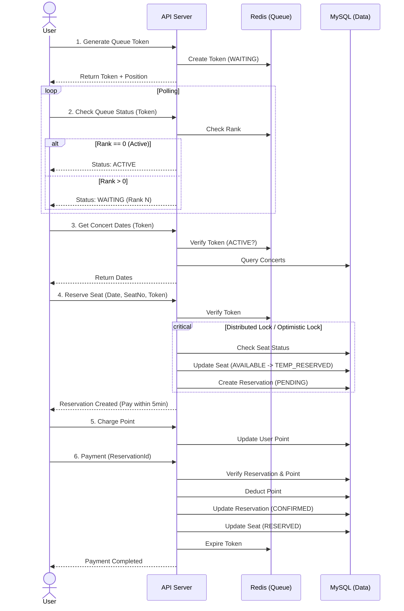

# Concert Reservation Service Architecture

## System Architecture

```mermaid
graph LR
    subgraph Client [Client Side]
        User((User))
    end

    subgraph LB [Load Balancing]
        L7(Load Balancer)
    end

    subgraph App [Application Server]
        direction TB
        QC[Queue Service]
        UC[User Service]
        CC[Concert Service]
        RC[Reservation Service]
        PC[Payment Service]
    end

    subgraph Infra [Infrastructure]
        direction TB
        MySQL[(MySQL DB)]
        Redis[(Redis Cache)]
        Kafka{{Kafka MQ}}
    end

    %% Client -> LB
    User --> L7
    
    %% LB -> App
    L7 --> QC
    L7 --> UC
    L7 --> CC
    L7 --> RC
    L7 --> PC

    %% App -> Infra
    QC -- Token --> Redis
    UC -- Point --> MySQL
    CC -- Schedule --> MySQL
    CC -- Cache --> Redis
    RC -- Tx --> MySQL
    PC -- Tx --> MySQL
    PC -- Event --> Kafka

    classDef service fill:#e1f5fe,stroke:#01579b,stroke-width:2px;
    class QC,UC,CC,RC,PC service;
    
    classDef infra fill:#fff3e0,stroke:#e65100,stroke-width:2px;
    class MySQL,Redis,Kafka infra;
```

## Queue & Reservation Flow

```mermaid
sequenceDiagram
    actor User
    participant API as API Server
    participant Redis as Redis (Queue)
    participant DB as MySQL (Data)

    %% 1. Queue Token Loop
    User->>API: 1. Generate Queue Token
    API->>Redis: Create Token (WAITING)
    API-->>User: Return Token + Position

    loop Polling
        User->>API: 2. Check Queue Status (Token)
        API->>Redis: Check Rank
        alt Rank == 0 (Active)
            API-->>User: Status: ACTIVE
        else Rank > 0
            API-->>User: Status: WAITING (Rank N)
        end
    end

    %% 2. Enter Service
    User->>API: 3. Get Concert Dates (Token)
    API->>Redis: Verify Token (ACTIVE?)
    API->>DB: Query Concerts
    API-->>User: Return Dates

    %% 3. Reserve Seat
    User->>API: 4. Reserve Seat (Date, SeatNo, Token)
    API->>Redis: Verify Token
    
    critical Distributed Lock / Optimistic Lock
        API->>DB: Check Seat Status
        API->>DB: Update Seat (AVAILABLE -> TEMP_RESERVED)
        API->>DB: Create Reservation (PENDING)
    end
    
    API-->>User: Reservation Created (Pay within 5min)

    %% 4. Payment
    User->>API: 5. Charge Point
    API->>DB: Update User Point

    User->>API: 6. Payment (ReservationId)
    API->>DB: Verify Reservation & Point
    API->>DB: Deduct Point
    API->>DB: Update Reservation (CONFIRMED)
    API->>DB: Update Seat (RESERVED)
    API->>Redis: Expire Token
    API-->>User: Payment Completed
```