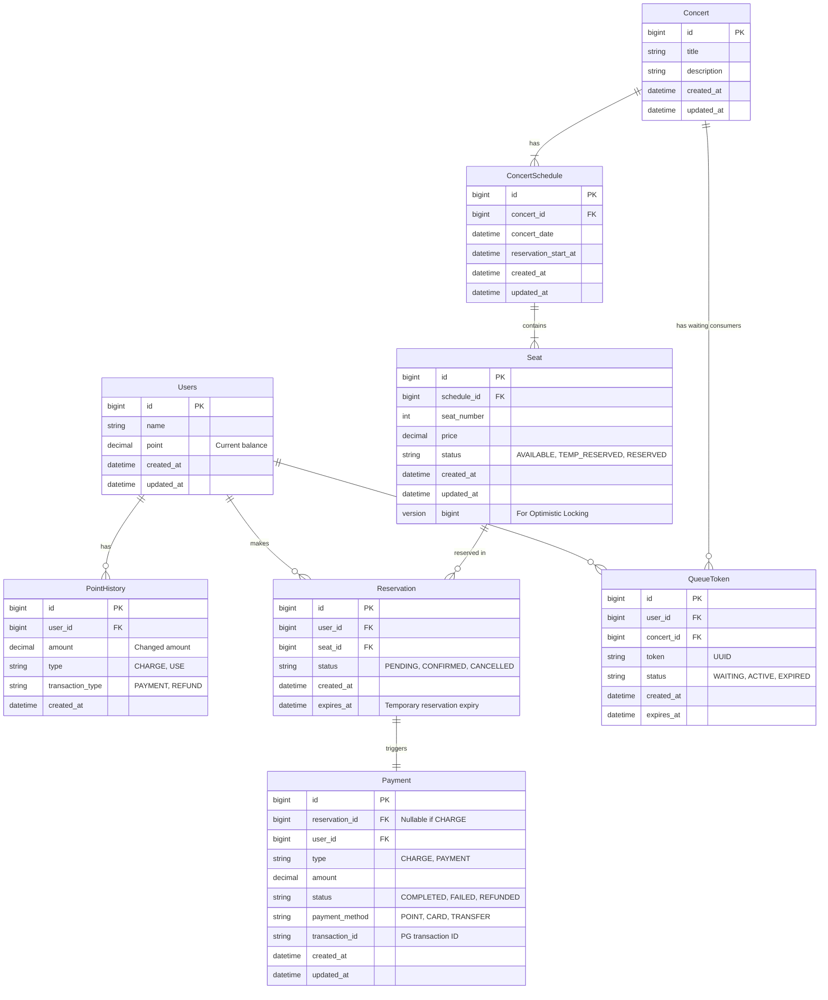

# Concert Reservation Service ERD

```mermaid
erDiagram
    Users ||--o{ PointHistory : "has"
    Users ||--o{ Reservation : "makes"
    Users ||--o{ QueueToken : "issued"
    
    Concert ||--|{ ConcertSchedule : "has"
    Concert ||--o{ QueueToken : "has waiting consumers"
    ConcertSchedule ||--|{ Seat : "contains"
    
    Seat ||--o{ Reservation : "reserved in"
    Reservation ||--|| Payment : "triggers"

    Users {
        bigint id PK
        string name
        decimal point "Current balance"
        datetime created_at
        datetime updated_at
    }

    PointHistory {
        bigint id PK
        bigint user_id FK
        decimal amount "Changed amount"
        string type "CHARGE, USE"
        string transaction_type "PAYMENT, REFUND"
        datetime created_at
    }

    Concert {
        bigint id PK
        string title
        string description
        datetime created_at
        datetime updated_at
    }

    ConcertSchedule {
        bigint id PK
        bigint concert_id FK
        datetime concert_date
        datetime reservation_start_at
        datetime created_at
        datetime updated_at
    }

    Seat {
        bigint id PK
        bigint schedule_id FK
        int seat_number
        decimal price
        string status "AVAILABLE, TEMP_RESERVED, RESERVED"
        datetime created_at
        datetime updated_at
        version bigint "For Optimistic Locking"
    }

    Reservation {
        bigint id PK
        bigint user_id FK
        bigint seat_id FK
        string status "PENDING, CONFIRMED, CANCELLED"
        datetime created_at
        datetime expires_at "Temporary reservation expiry"
    }

    Payment {
        bigint id PK
        bigint reservation_id FK "Nullable if CHARGE"
        bigint user_id FK
        string type "CHARGE, PAYMENT"
        decimal amount
        string status "COMPLETED, FAILED, REFUNDED"
        string payment_method "POINT, CARD, TRANSFER"
        string transaction_id "PG transaction ID"
        datetime created_at
        datetime updated_at
    }
    
    QueueToken {
        bigint id PK
        bigint user_id FK
        bigint concert_id FK
        string token "UUID"
        string status "WAITING, ACTIVE, EXPIRED"
        datetime created_at
        datetime expires_at
    }
```
